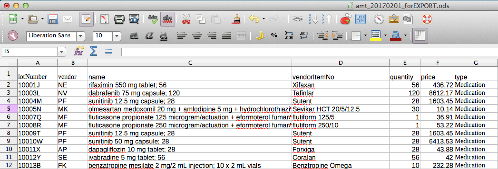

This folder contains sample data sets which import with the import command fromt the server repository, e.g.: `utils/inv-import.js file.csv YYYY-MM-DD`

### Medications

source | filename | description | header information | notes 
-------|----------|-------------|--------------------|-------
http://www.pbs.gov.au/browse/downloads | amt_20170201.csv | Australian PBS database | see [here](https://dev.pbs.gov.au/readme.html) You will need to remove unnecessary columns in the data and add a header line with details similar to the image below (LibreOffice calc is useful for this) | this database includes all Australian PBS drugs.  The delimiter is `!`. To use the file it needs to be slightly modified (commas replaced with semi-colons). 

### Images
- details of colums for PBS import

